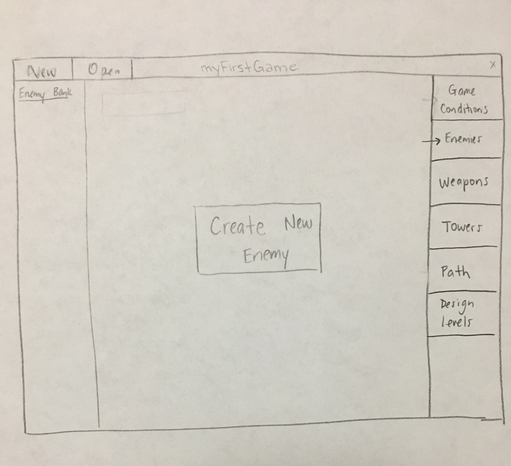
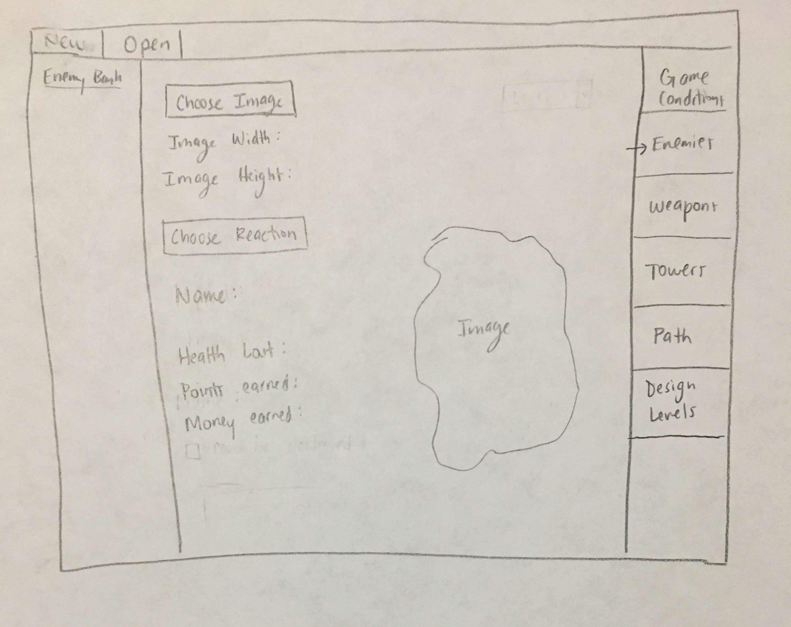
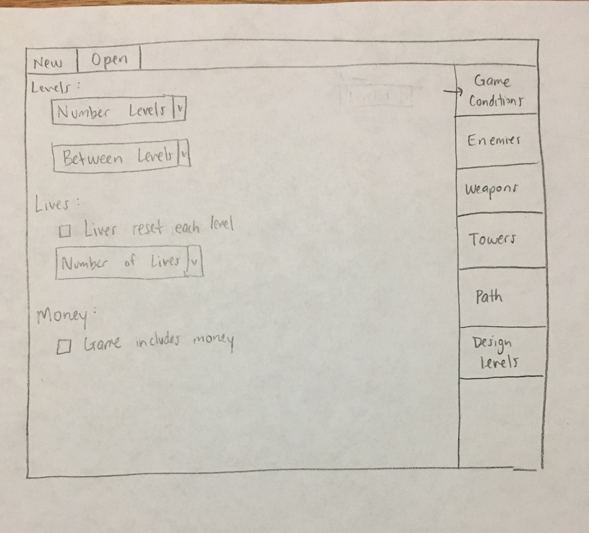
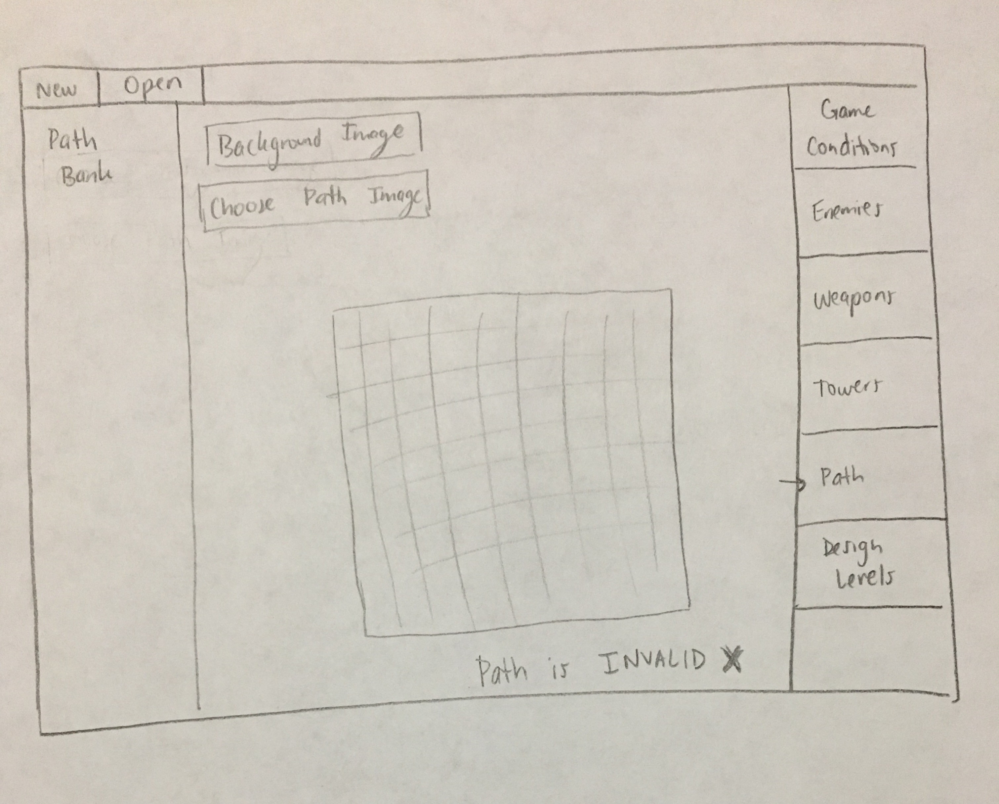
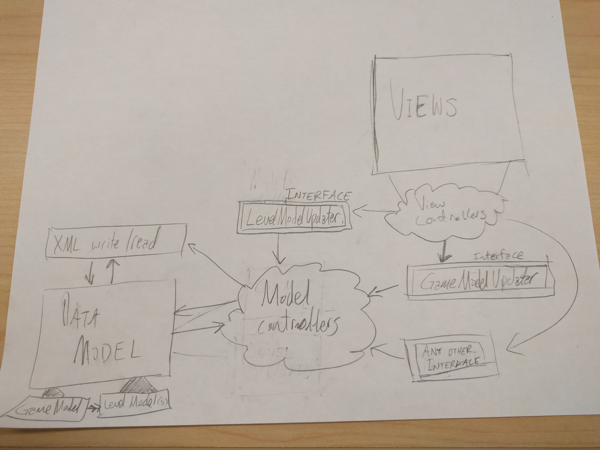
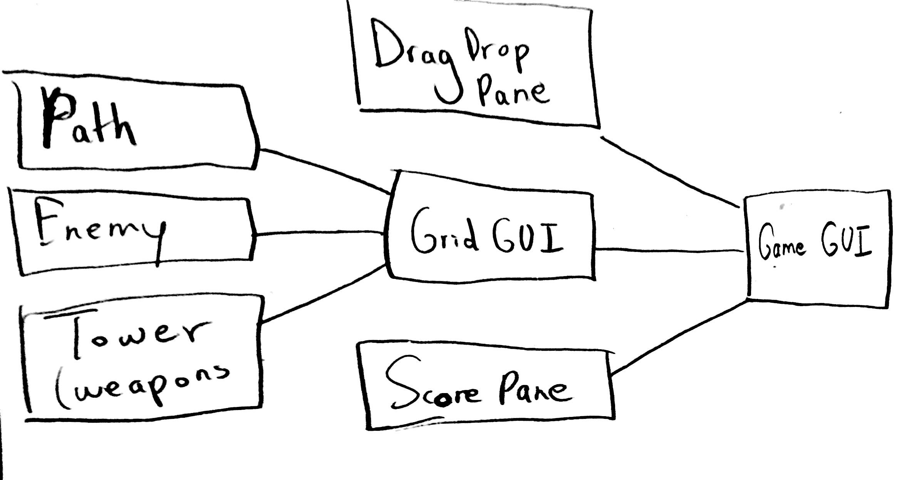

# Introduction
Our group will be implementing a game authoring and playing environment for tower defense games. We will need to support different types of tower defense games, such as Bloons and Plants vs. Zombies, which means we need the design to be very flexible in what kind of decisions it allows the user to make when creating a game and how a player interacts with the game. 

# Overview
At a high level, this project is divided into the "game authoring environment" and the "game player". The authoring environment will allow users to create their tower defense game and define settings. These settings and specifications will be recorded in an XML file (run by the game engine).
Once the user decides the play the game, the game player will accept the XML file from the game engine and load the game. With this design, the primary means of communication between these two parts is the XML file. The only information the game player program needs to load the game is the game data, which the game authoring environment provides in the XML file. 
##### Game Player
###### Overview
In the game player, we are dividing the work into parsing the xml file, using the data to create the game logic (back end), and displaying the game to the user (front end). The back and front ends will communicate through controllers. There will be many controllers, each of which represent a type of view. Each of these controllers will pass data and modifications between the model and the view (using observables). 
##### Back End high level design
###### XML parser
- sharing basics with game authoring

###### Model
- basic structure: Tower, Weapon, Enemy
- use the type classes in the authoring part for contructing instance
- manager classes
- observable binding with front end
- controller for each moving object


##### Game Authoring
The game authoring environment will communicate to the game engine through interfaces. When game authoring needs to set an item in the game engine, it will call the set interface, passing the necessary information to the game engine. The game authoring environment will not communicate with the game player.
# User Interface

The user interface will contain two toolbars: a main toolbar and a tabbed-toolbar. The main toolbar will give the user the ability to open another, previously saved game, create a new game, see the title of the current game design, and the ability to close the window. The side toolbar contains the subcomponents of the game that the designer can change. This would include components such as game conditions, enemies, weapons, towers, and path. Each component will change the main screen with its particular elements such as choosing the image of the enemy, its speed, etc.







# Design Details

## Game Authoring Environment (View)
Program of visual tools for placing, specifying, editing, and combining general game elements together to make a particular game

### Modules:
* GameConditions (number of rounds, health, money…)
* EditingInterface: Interface to create the game 
*Each subcomponent of the modules will have an interface to pass necessary information to the game engine, along with an interface to create their particular view. In regards to the latter, each subcomponent will create its own pane and components so it is loaded in one main DesignScene, what is ultimately seen by the user.
* Enemy: Displays all of the available enemy images, contains dropdowns/input fields to set enemy settings
    * EnemyView
    * EnemyImageView
    * EnemyReactionsView
    * EnemySpeedAndFrequencyView
* Weapon: Displays input fields for weapon settings
    * WeaponView 
    * WeaponEffectView
    * WeaponImageView
* Tower: Displays input fields for tower settings
    * TowerView
    * TowerFrequencyView
    * TowerImageView
    * TowerRangeView
    * TowerSpeedView
* Level: Displays design options for each level

## Game Engine (Model): 
Framework of general Java classes to support any kind of game within a specific game genre



This module will be responsible for storing the inputed data from the game authoring environment and output an xml file for the game player to read.
It will accomplish this by receiving values from the Game Authoring Environment. When the authoring environment is done creating a specific module (i.e enemy, weapon, tower),
the authoring environment will call an interface to set the updated changes. These interfaces will be set up through the main controller that interacts with the authoring environment and engine.
The call will then be traced to the proper module and set the corresponding data that will ultimately be put into the XML. The model with then notify the front end authoring
environment of the changes through an observer pattern. Observers in the view will be notified of these changes and update their display accordingly. This design can be easily
extend by adding another base class to account for a new module or by subclassing one of the existing abstract ones to account for the new desired functionality. This design corresponds
with its main principles of the data not having to know about the front end and not having to know about the game player.

### Classes:
* Tower (abstract class?)
    * Subclasses represent tower types
    - Upgrades represented as subclasses of subclasses?
    ### Variables
    - attackRange: Determines the distance at which the tower can attack enemies
    - fireRate/frequency: Determines how much time it takes the tower to reload and fire again.
    - Weapon instance
    - Ground vs. Aerial 
    - Cost
    - Attack preference (first vs last)   
    - Image

* Weapon
    * Upgrade-able weapons?
    * Image: Image representing bullet
    * Hitbox: Hitbox to check to see if you hit enemy
    * Damage: Determines how much damage this tower inflicts on enemies
    * SlowRate: Determines how much this bullet will slow enemies
    * Piercing: Determines whether the bullet will pierce through multiple enemies    
    * Projectile Path? Curving, boomerang, etc.
    * Effect
    * Spread
    * Projectile Speed
    * Image
    * Hit effect – object representing effect on enemy after hit by certain type of projectile
    * Enemy
    * Speed
    * Image?
    * HP
    * Layering? 
    * Death effect
    * Regen?
    * Image
    * EnemyPath 
This may be auto-generated if we do “open” type
* Player: made using the game authoring environment, creates a user with # of lives, wealth, etc.
* BattleGrid (of some sort)
* Profile (name, etc. idk)
* Terrain
* Affects how enemies move, where towers can be placed
* Water/Deadspace
* Level
    * Numbers/types of creeps
    * Release times
    * Game Logic (how the enemies move: randomly vs. …)
    * Interval time vs. Manual Start

* Game Setting
    * Health/gameover condition (number of creeps that can pass)
    * Score?
    * Number of Levels
* Map/Board/whatever
    * Size
    * Terrains locations
    * Background image


## Game Data:
Files, assets, preferences, and code that represent a particular game

### Classes
* XML data:
    * Tags:
        * num_towers
        * num_enemies
        * grid_position

Example Layout
XML Basic Design

``` xml

<isValid> Boolean
<gameSetting>
	<title>
<background>
	<tower>
		<name>
		<imagePath>
		<isDestroyable>
		<range>
		<fireRate (int)>
		<cost>
		<unlockLevel>
		<weaponType>
		<upgrade>
			<cost>
			<type>


<enemy>
	<name>
	<imagePath>
<widthOfImage>
	<heightOfImage>
	<speed>
	<health>
	<points>
	<money>
	<collisionEffect> ?
<weapon>
	<name>
	<imagePath>
	<weaponEffect>
	<projectileSpeed>
	<damage>
<path @imagePath>
	<type>
	<coordinates>
		<coordinate>
		…

<level>
<enemies>
<type> # </type>
<healthRegeneration>
<points>
<money>
```

## Game Player:
program that loads the game data and uses the game engine to run a particular game
### View
Classes:
* BattleGrid: Grid that contains the towers, enemies, etc.
* EventHandler: To drag and drop ALL THE THINGS
* EnemyAnimator: Handles animation of the enemy (any cool effects?), holds all of the animation effects
* WeaponAnimator: Handles animation of weapons
## Model（Back end）
* XML Loader: Loads information from game engine
* Abstract enemy, tower classes


### Controller
Classes:
* Tower Manager
* Game Setting Manager

### Model
Classes:
* GamePlayModel: primary class containing all game objects, updates grid
* Tower: fires weapons, has cost
* Enemy
* Grid: represents the area of gameplay, enemies move along paths in the grid
* Weapon
* Cell: point on the grid, collisions of weapons and enemies occur within cells
* Collision: has enemy and weapon attributes, effect of collision is updated on the enemy object


# Example Games
   1. Bloons - Classic tower defense game where the game authoring environment allows for drag-and-dropping towers as well as outlining the path.
   2. Plants vs Zombies - Variation of a tower defense game where there are multiple paths and that the enemies can destroy the towers. The game authoring environment will allow for the user to define multiple paths as well as set the towers to be destructable.
   3. Boxhead - Abstract take on a tower defense game where the paths are dynamic and the destination point is movable. The game authoring environment will allow for the selection of the path type as well as the destination option.


# Design Considerations
We will need to consider the exact information that needs to be included in the XML file. This file is meant to encompass all game data/settings that are defined by the game author, so we must decide the type of data that will be in the XML. We also need to determine how to transition from the game authoring environment to the game playing environment.

### Game Playing Environment Considerations
Some design choices we considered was how to update the position of the enemies. For some types of Tower Defense games, the enemies move along a path, but in other types, the enemies move straight across the screen. We decided to use a grid to represent the space in which the enemies move, and their paths will be defined by the cells on the grid. Moving forward, we will have to decide if we want to detect collisions from the occupants of a single cell, or if two objects have the same x and y coordinates. The advantage of using the cell method is that it is easier to detect collisions, but it also requires handling the case when multiple enemies occupy the same cell.

### Game Engine Considerations
Some design choices we considered was how to represent the path in terms of coordinates. We could have made x and y for
pixels or used grid coordinates. While using pixel locations for the x and y would have been more exact and look more
fluid, we decided to ultimately go with grid coordinate for the path. Having discussions with the Game Player side
made us realize that it would be easier for them to have grid coordinates. We also had discussions on how the game
authoring environment would interact with the game engine. We had to decide how often to update the model when the view
changed. We ultimately decided to have the authoring environment create interfaces with methods that will perform tasks
they need the backend to perform. Then, the game engine will implement these interfaces to change the model. We will
then use observable observer design pattern to update the necessary view components. By doing this we are hiding from
the view how we implement the changes in the backend and by using the Observer patter, we are able to signal to the
necessary front end components.

### Game Authoring Environment considerations
One design choice we considered was how to determine the different attributes of each level. For example, an enemy could have a different frequency at each level, but we had to decide if that frequency will be determined in the enemy class (with a combo box for the user to set which level they were adding an attribute to) or in a new Design Level class. At this point, we have decided to use a DesignLevel class. After looking at the way the xml file is formatted, we decided that it would be easier for the backend to interpret information if we send it by level. Also, this design allows the user to make a new level by only working in one or two tabs of the user interface. Another design consideration was how often the view should be updating the model (also discussed in game engine considerations). One reason to constantly update the model is to allow for the future extension of allowing two people to create a game together, at the same time. However, this could cause invalid data to be passed to the backend if the user is in the middle of creating something, like an enemy. 

### Frontend
  
